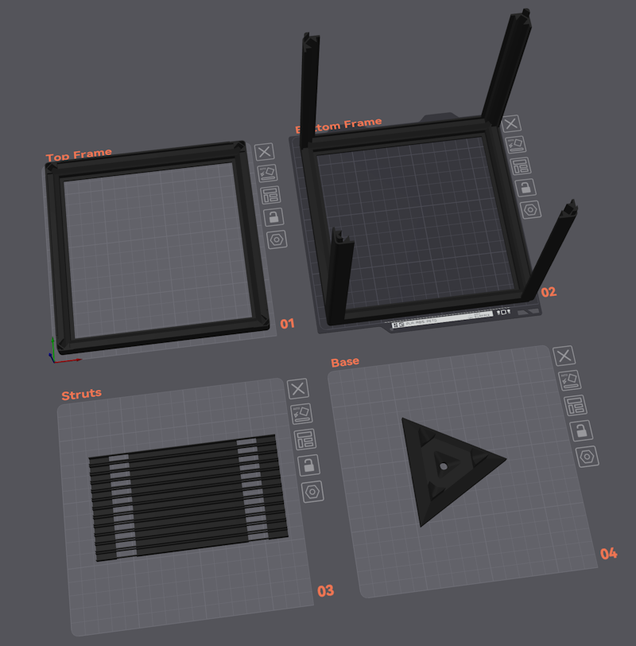
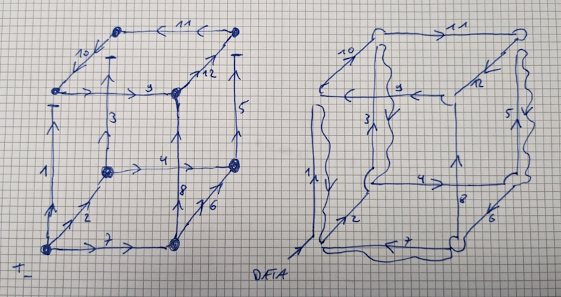
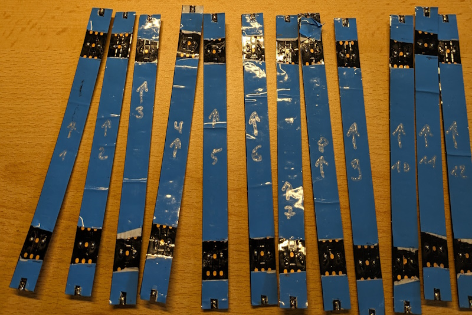
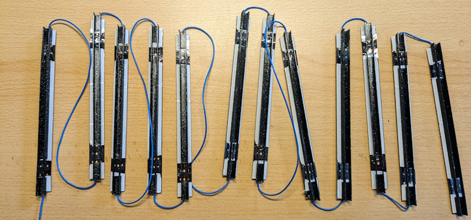
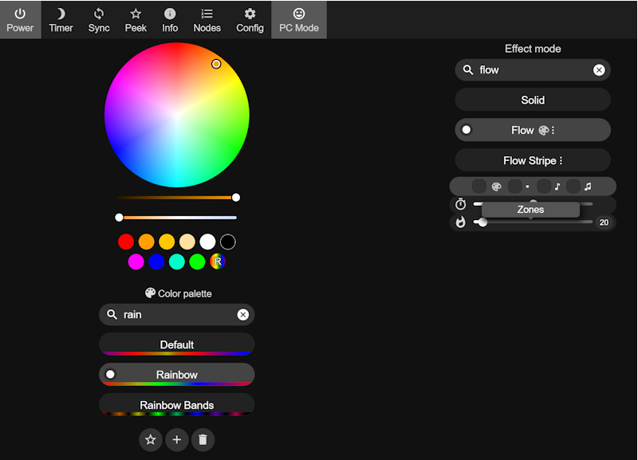

This is a fork of the Infinity-Cube project by [s-marlex](https://github.com/s-marley/Infinity-Cube) (or see below)

In my project, there are a few things changed.

1. The included 3D-Printfiles are scaled to 171x171x171mm
 - This allows them to be printed perfectly on a Prusa Mini or a Bambulab A1 Mini
 - The needed mirrors are exactly 150x150mm, which is easier to buy
 - The grow in size should allow the use of standard 144LED/m Strips that are much more cheaper than the original ones
   (e.g. https://de.aliexpress.com/item/2036819167.html )
   This results in 20LEDs per Strut
 - The standard LED-Strips provide a "natural" seal for the mirrors an hopefully hold them in place automatically
 - I extended the Base, to create place for the controller-electronics (was a separate Box in the the original project)
2. The Cube is no longer cut in half, instead the top is alone and the struts are complete at the bottom part
 - I hope this will make the assembly easier.
3. Instead of creating a custom binary for the electroics I use standard [WLED](https://kno.wled.ge/)

---

---

With the new Cube-Parameters I changed the wiring in the Schematics

On the left side, there is the wiring of the power-lines (VCC + GND), on the right side the new data-wiring.

---

The LED-Strips are cut every 20 LEDs. To be able to do all soldering on the backside of the strip I removed the double-sided tape where the cutouts in the struts are.

Then I presoldered the PADs for + and - to make it easier to wire them later
As the Data-PADs were very small, I scraped away the protective varnish with a scalpel and presoldered them, too.

---

---

To have a starting point in WLED, here is a screenshot of some basic setting that works out of the box

---
---

Original project
https://github.com/s-marley/Infinity-Cube

YouTube Video

