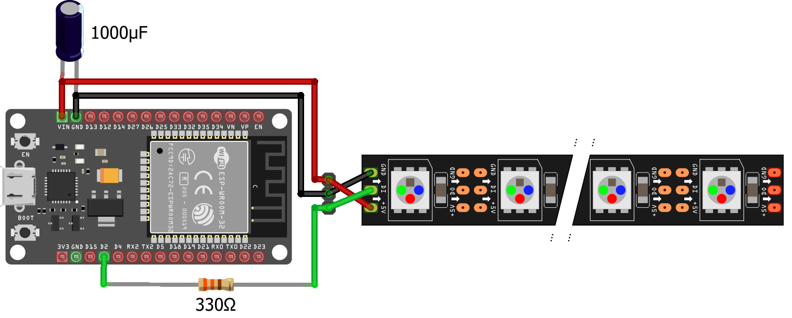
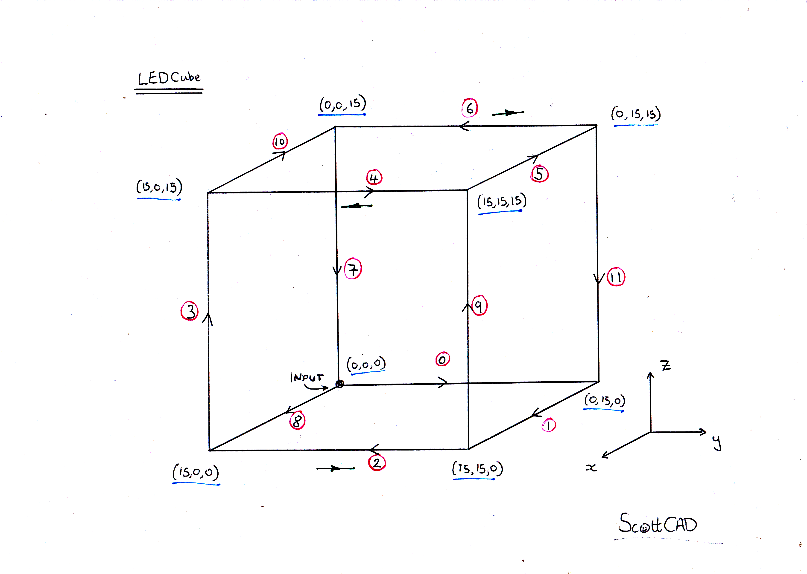

This is a fork of the Infinity-Cube project by [s-marlex](https://github.com/s-marley/Infinity-Cube) (or see below)

In my project, there are a few things changed.

1. The included 3D-Printfiles are scaled to 171x171x171mm
- This allows them to be printed perfectly on a Prusa Mini or a Bambulab A1 Mini
- The needed mirrors are exactly 150x150mm, which is easier to buy
- The grow in size should allow the use of standard 144LED/m Strips that are much more cheaper than the original ones
- The standard LED-Strips provide a "natural" seal for the mirrors an hopefully hold them in place automatically
2. The Cube is no longer cut in half, instead the top is alone and the struts are complete at the bottom part
- I hope this will make the assembly easier.

Original project
# Infinity-Cube
A small infinity cube programmed with FastLED. The cube, stand and electronics box are 3D printed, fusion and STL files can be found in the Fusion360 folder. The patterns are generated using the FastLED library, code can be found in the LEDCube folder.
This project uses tiny LED strips which can be found here:
- [Adafruit (US)](https://www.adafruit.com/product/4368)
- [PiHut (UK)](https://thepihut.com/products/ultra-skinny-neopixel-1515-led-strip-4mm-wide)
- [Alibaba (Worldwide)](https://ipixelleds.en.alibaba.com/product/1600100606010-801743685/4mm_Width_Tiny_ultra_thin_SMD1515_75leds_m_Addressable_LED_Strip_light.html)

## YouTube Video

## Wiring and connections
The wiring for the project is very simple and is shown below. The resistor and capacitor are recommended but optional.

The diagram below shows how the segments of the cube are connected together. Pink circles are the segment numbers. Green arrows show where the data line has to be run back underneath a strip. Wiring enters the cube through the rear-left.

